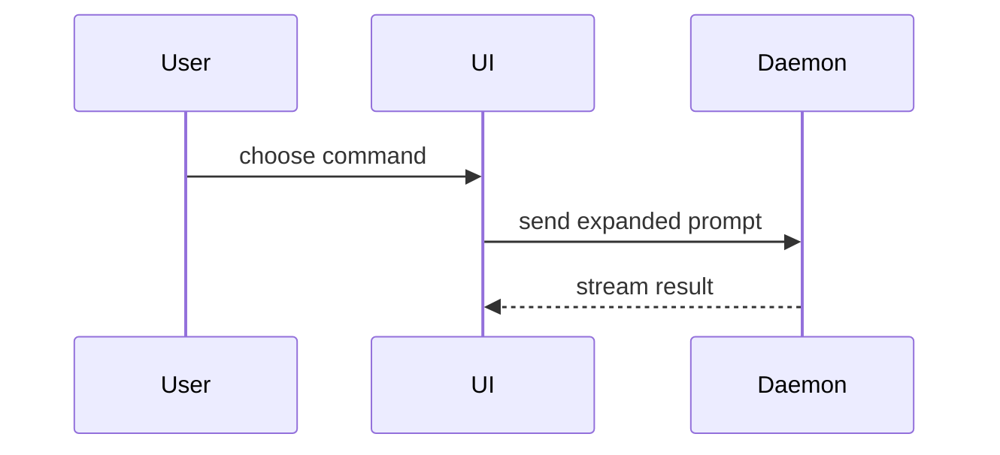

Open a draft pull request for the current branch against the repo's default branch. Base the title and body on the branch's real commits and diff. Run the steps in order. Each step ends on a condition you can check.

If the user only asks for a PR body, skip the steps. Write the body (step 4, body only) and return it without pushing or creating anything.

## Steps

1. **Establish base and head.** Head is `git branch --show-current`. Base is the repo default branch: `gh repo view --json defaultBranchRef -q .defaultBranchRef.name` (fall back to the name in `git symbolic-ref refs/remotes/origin/HEAD`). If head equals base, stop and tell the user that a PR cannot be opened from the default branch. _Done when both names are known and head ≠ base._

2. **Check for an existing PR.** Run `gh pr list --head <head> --state open`. If a PR already exists, report its URL and stop. Never open a duplicate. _Done when the list is empty, or you have stopped._

3. **Push the branch.** If the branch has no upstream (`git rev-parse --abbrev-ref @{u}` fails), run `git push -u origin <head>`. Otherwise run `git push`. _Done when the remote head matches local HEAD._

4. **Compose title and body.** Read `git log <base>..HEAD --oneline` and `git diff <base>...HEAD`. Base the content on what changed, never on guesses.

   - **Title:** a short imperative summary. If the branch name contains an issue key (e.g. `DS-146`, `ABC-1234`), use it as the title prefix: `[DS-146] Fix the bug in the payment flow`.
   - **Body:** follow the [PR body](#pr-body) template and section guidance below.

   _Done when the title and body cover every commit in the range._

5. **Create the draft.** Write the body to a temp file and run `gh pr create --draft --base <base> --head <head> --title "<title>" --body-file <file>`. A file keeps backticks, code fences, and Mermaid intact. Report the returned URL. _Done when the URL is printed._

## PR body

Use this template for writing the PR body:

```markdown
## Summary

<diagram, diff-sketch, or tree>

## Evidence

- **Before:** <screenshot/output/failing test run>
  **After:** <screenshot/output/passing test run>

## Merge Danger

**Door:** <one-way or two-way>

<optional: description>

**Blast Radius:** <one-word description>

<optional: potential ramifications of merge>
```

Skip all preambles and keep prose brief. Use the user's domain language from `GLOSSARY.md` when the repo has one.

### Summary

Pick the smallest view that makes the key point clear.

- Show logic or an algorithm as pseudocode:

```text
on(save)
  if content is unchanged
    return cached result
  write new content
  return fresh result
```

- Show runtime control flow as a call tree:

```text
submitForm
  createSession
    persistPrompt
    launchAgent
  navigateToSession
```

- Show UI structure as a component tree, including state and module boundaries that matter:

```text
<SessionPage> (apps/example/src/routes/session.tsx)
  useSessionEvents()
  <SessionToolbar>
    <RunSkillButton> (packages/ui)
```

- Show file responsibility or a broad refactor as a shallow file tree:

```text
src/
├── commands/       # parses user actions
├── sessions/       # owns session state
└── transport/      # sends API requests
```

- Show component interaction, control flow, or data flow with Mermaid:



- Use `diff` when the point is what changes and the surrounding shape already exists. Match the diff shape to the topic.

For a component change:

```diff
 <SessionPage>
   useSessionEvents()
   <SessionToolbar>
+    <RunSkillButton />
   <SessionTimeline>
+    <SkillResultCard />
```

For a file-layout change:

```diff
 src/
 ├── commands/
+│   └── show-me.ts       # expands the slash command
 ├── sessions/
-└── transport.ts
+└── transport/
+    ├── client.ts
+    └── stream.ts
```

For a call-tree or call-stack change:

```diff
 submitForm
   createSession
     persistPrompt
+    expandSkillMention
     launchAgent
-  navigateToSession
+  navigateToSession
+    subscribeToEvents
```

For a state or control-flow change:

```diff
 on(save)
-  write content
+  if content is unchanged
+    return cached result
+  write new content
+  invalidate cache
```

- Show the whole block when most of it is new, when omitted context would hide ownership or order, or when the user needs a copyable target shape:

```ts
function expandSkill(command: string): string {
  const skillName = command.slice(1);
  return `use the ${skillName} skill`;
}
```

#### Choosing a view

Place each visual next to the short text it supports. Keep only the calls, files, props, states, and boundaries needed to explain this change to a reviewer.

You may use one of these, you may use several, it is unlikely you will use all of them. Use your judgement and don't overwhelm the reviewer.

### Evidence

Concrete evidence that the change works. Show a before and after.

Screenshots are S-tier - when the environment is set up for it and the change is visual.

Execution-based evidence is A-tier. Test results, console output. Show the exact test that now fails and passes, using pseudocode.

### Merge Danger

Describe whether it's a one-way or two-way door. You can walk back through two-way doors, but not one-way doors. A PR that is cheap to roll back is lower risk. Changes that involve destructive actions or hard-to-reverse decisions are one-way doors.

The blast radius is the potential impact or scope of the changes introduced by this PR. Consider all possibilities. Examples are layout shift, breakages for consumers, mobile responsiveness, etc.
